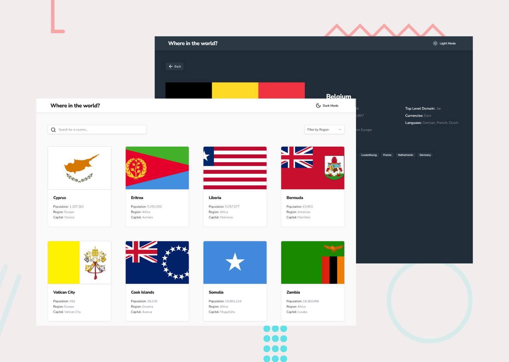

# Frontend Mentor - REST Countries API with color theme switcher solution

This is a solution to the [REST Countries API with color theme switcher challenge on Frontend Mentor](https://www.frontendmentor.io/challenges/rest-countries-api-with-color-theme-switcher-5cacc469fec04111f7b848ca). Frontend Mentor challenges help you improve your coding skills by building realistic projects.

## Table of contents

- [Overview](#overview)
  - [The challenge](#the-challenge)
  - [Screenshot](#screenshot)
  - [Links](#links)
- [My process](#my-process)
  - [Built with](#built-with)
  - [What I learned](#what-i-learned)
  - [Continued development](#continued-development)
  - [Useful resources](#useful-resources)
- [Author](#author)

## Overview

### The challenge

Users should be able to:

- See all countries from the API on the homepage
- Search for a country using an `input` field
- Filter countries by region
- Click on a country to see more detailed information on a separate page
- Click through to the border countries on the detail page
- Toggle the color scheme between light and dark mode _(optional)_

### Screenshot



### Links

- Solution URL: [https://www.frontendmentor.io/solutions/responsive-rest-countries-api-using-react-O6CDWQ0KLp](https://www.frontendmentor.io/solutions/responsive-rest-countries-api-using-react-O6CDWQ0KLp)
- Live Site URL: [https://visualsource.github.io/county-viewer](https://visualsource.github.io/county-viewer)

## My process

### Built with

- Semantic HTML5 markup
- CSS custom properties
- Flexbox
- Mobile-first workflow
- [React](https://reactjs.org/) - JS library
- [Tailwindcss](https://nextjs.org/) - For styles
- [Typescript](https://www.typescriptlang.org/) - Typescript
- [Shadcn-ui](https://ui.shadcn.com/) - Collection of re-usable react components
- [Tanstack Query](https://tanstack.com/query/latest)
- [React Router Dom](https://reactrouter.com/en/main) - Router Library
- [Vite](https://vitejs.dev/) - Bundler

### What I learned

I found out that use can use the `matchMedia` function to run queries which help with getting user system preferences for dark and light modes.

```js
window.matchMedia("(perfers-color-scheme: dark)").matches;
```

### Continued development

future projects i'd like to continue to work with react as so far it is my faviorte framework to work with and i plan to use it more in the future.

### Useful resources

- [MDN | matchMedia](https://developer.mozilla.org/en-US/docs/Web/API/Window/matchMedia) - The documention of the matchMedia function

## Author

- Website - [https://visalsource.us](https://visalsource.us)
- Frontend Mentor - [@VisualSource](https://www.frontendmentor.io/profile/VisualSource)
- LinkedIn - [Collin Blosser](https://linkedin.com/in/collinblosser)
