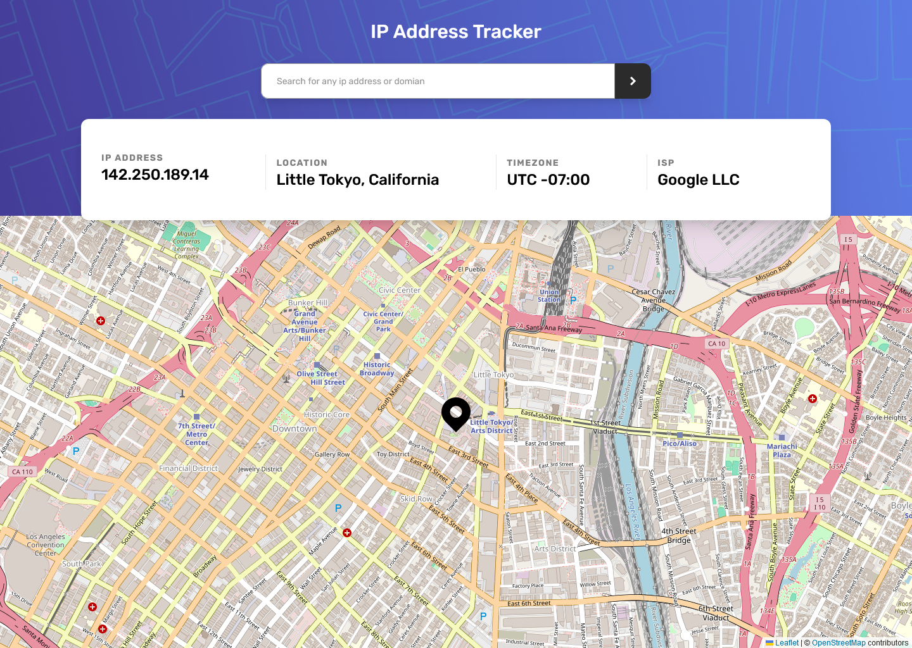

# Frontend Mentor - IP address tracker solution

This is a solution to the [IP address tracker challenge on Frontend Mentor](https://www.frontendmentor.io/challenges/ip-address-tracker-I8-0yYAH0). Frontend Mentor challenges help you improve your coding skills by building realistic projects.

## Table of contents

- [Overview](#overview)
  - [The challenge](#the-challenge)
  - [Screenshot](#screenshot)
  - [Links](#links)
- [My process](#my-process)
  - [Built with](#built-with)
  - [What I learned](#what-i-learned)
  - [Continued development](#continued-development)
  - [Useful resources](#useful-resources)
- [Author](#author)

## Overview

### The challenge

Users should be able to:

- View the optimal layout for each page depending on their device's screen size
- See hover states for all interactive elements on the page
- See their own IP address on the map on the initial page load
- Search for any IP addresses or domains and see the key information and location

### Screenshot



### Links

- Solution URL: [Add solution URL here](https://your-solution-url.com)
- Live Site URL: [https://visualsource.github.io/ip-address-tracker](https://visualsource.github.io/ip-address-tracker)

## My process

### Built with

- Semantic HTML5 markup
- CSS custom properties
- Flexbox
- Mobile-first workflow
- [Vue](https://vuejs.org/) - JavaScript framework
- [Leaflet](https://leafletjs.com) - An open-source JavaScript library
  for mobile-friendly interactive maps
- [TailwindCss](https://tailwindcss.com/) - A utility-first CSS framework
- [Vite](https://vite.dev) - Next Generation Frontend Tooling

### What I learned

During this project i learned how to use the Geolocation API web api, although this was not needed for this project i did use it to test the map.

```js
if ('geolocation' in navigator) {
  navigator.geolocation.getCurrentPosition(
    ({ coords }) => {
      console.log(coords)
    },
    (err) => {
      console.error(err)
    }
  )
}
```

### Continued development

In this project i used vue.js to build the ui for this project. I have using vue before but up until this point a had not finished a project using vue and this is defintly a framework that i would like to use again in the future.
Along side using vue i have used leaflet but i dont think that i had a good understanding of how to use the library, but now after completing this project i have a much better understanding of how to use it.

### Useful resources

- [MDN: Geolocation API](https://developer.mozilla.org/en-US/docs/Web/API/Geolocation_API) - How to use Geolocation api.
- [Leaflet Reference](https://leafletjs.com/reference.html) - Reference for Leaftlet.

## Author

- Website - [https://visualsource.us](https://visualsource.us)
- Frontend Mentor - [@VisualSource](https://www.frontendmentor.io/profile/VisualSource)
- LinkedIn - [Collin Blosser](https://linkedin.com/in/collinblosser)
