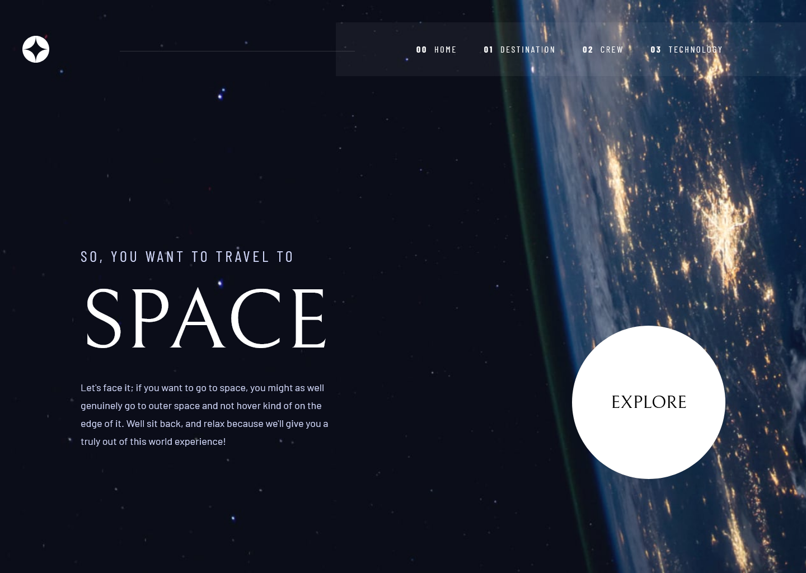

# Frontend Mentor - Space tourism website solution

This is a solution to the [Space tourism website challenge on Frontend Mentor](https://www.frontendmentor.io/challenges/space-tourism-multipage-website-gRWj1URZ3). Frontend Mentor challenges help you improve your coding skills by building realistic projects.

## Table of contents

- [Overview](#overview)
  - [The challenge](#the-challenge)
  - [Screenshot](#screenshot)
  - [Links](#links)
- [My process](#my-process)
  - [Built with](#built-with)
  - [What I learned](#what-i-learned)
  - [Continued development](#continued-development)
  - [Useful resources](#useful-resources)
- [Author](#author)

## Overview

### The challenge

Users should be able to:

- View the optimal layout for each of the website's pages depending on their device's screen size
- See hover states for all interactive elements on the page
- View each page and be able to toggle between the tabs to see new information

### Screenshot



### Links

- Solution URL: [Add solution URL here](https://your-solution-url.com)
- Live Site URL: [https://visualsource.github.io/space-tourism-site](https://visualsource.github.io/space-tourism-site)

## My process

### Built with

- Semantic HTML5 markup
- CSS custom properties
- Flexbox
- CSS Grid
- Mobile-first workflow
- [Svelte](https://svelte.dev/) - JS library
- [SvelteKit](https://kit.svelte.dev/) - Svelte framework
- [Tailwindcss](https://tailwindcss.com/sv) - For styles
- [Vite](https://vite.dev) - Bundler

### What I learned

- Learned how to create a frosted glass effect for a container, the way this is done seems to be very simple just a color with opacity and setting the `backdrop-filter` blur property will create the effect.

```css
/** Create frosted glass effect */
.container {
	background-color: rgba(255, 255, 255, 0.15);
	backdrop-filter: blur(5px);
}
```

- Learned how to scale a inline svg element to the parent container, this can be done by setting the viewbox property and giving the svg element full height and width. This will allow for the svg to scale to the parent container

```html
<svg style="height: 100%; width: 100%" viewbox="0 0 10 10">
	<!--Svg content-->
</svg>
```

### Continued development

In future id like to focus on using css grid more as it is a very powerful part of css, that i don't use a lot.

### Useful resources

- [Grosted Glass Efect](https://webdesign.tutsplus.com/how-to-create-a-frosted-glass-effect-in-css--cms-32535t) - How to create a frosted glass effect in css
- [MDN: backdrop-filter](https://developer.mozilla.org/en-US/docs/Web/CSS/backdrop-filter) - What and how to use the backdrop-filter property
- [Scale svg to parent](https://stackoverflow.com/questions/19484707/how-can-i-make-an-svg-scale-with-its-parent-container) - Resource on how to scale svg element to its parent container

## Author

- Website - [https://visualsource.us](https://visualsource.us)
- Frontend Mentor - [@VisualSource](https://www.frontendmentor.io/profile/VisualSource)
- LinkedIn - [Collin Blosser](https://linkedin.com/in/collinblosser)
